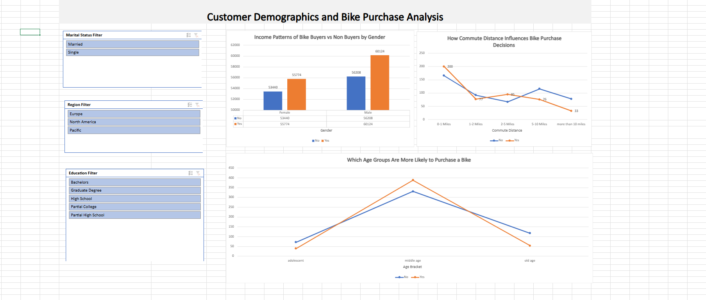
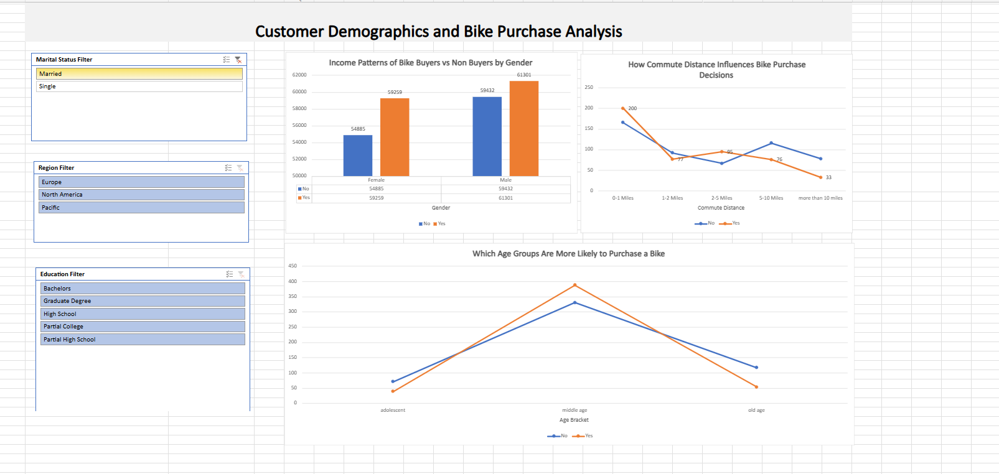
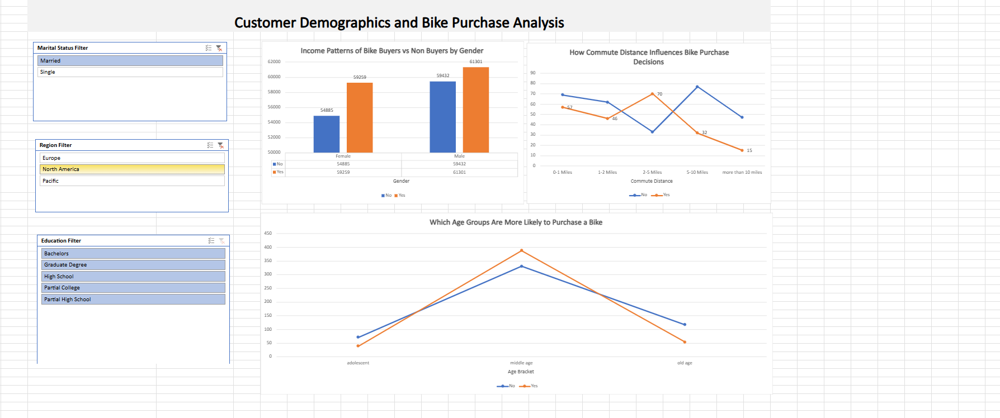
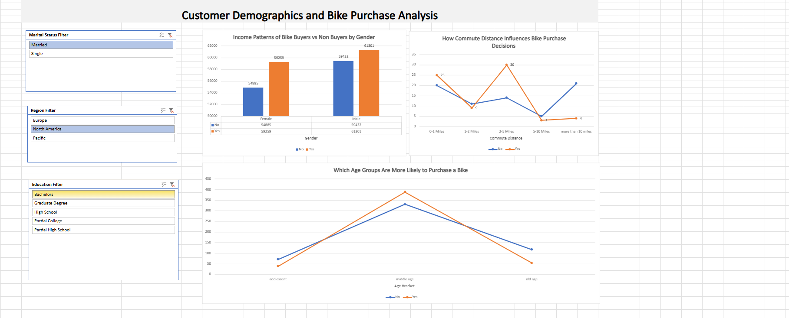
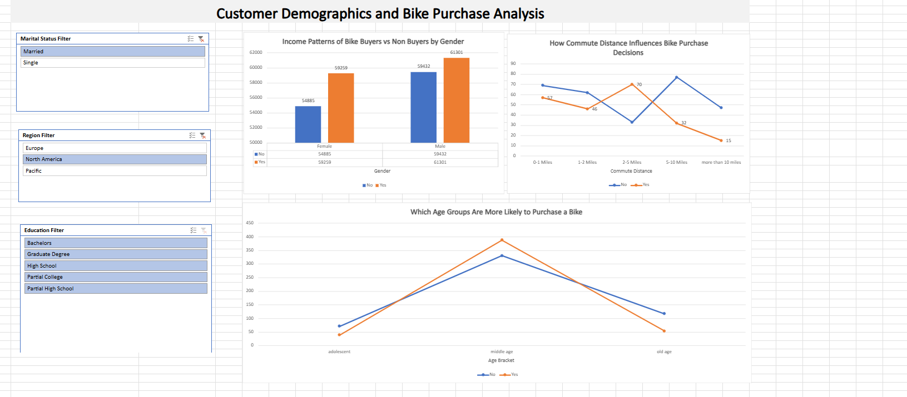

# Excel Bike Purchase Analysis Dashboard

## Why I Built This Project
I built this project to practice an end to end Excel data analysis workflow.  
Instead of jumping straight to charts, I wanted to understand how raw customer data can be cleaned, structured, and then turned into insights that actually help decision making.

The focus of this project is to understand **bike purchasing behavior** using customer demographics and lifestyle information.

> Note. This dashboard is fully interactive in Excel Desktop.  
> GitHub preview and Excel Online do not support slicers.

## What This Project Does
This project answers simple but important questions:
- Who is more likely to purchase a bike?
- Does age or income influence purchasing decisions?
- How do factors like marital status and commute distance affect behavior?

Excel slicers were used so that a business user can explore these questions without touching filters or formulas.

## About the Dataset
The dataset contains customer level information such as:
- Age, income, marital status, and occupation
- Commute distance and region
- Bike and car purchase indicators

This data was provided in a raw format and required cleaning before analysis.

## How I Prepared the Data
Before any analysis, I focused on making the data reliable:
- Removed duplicate records to avoid incorrect counts.
- Standardized category values to keep the data consistent.
- Created **age groups** to make trends easier to interpret.
- Created **income segments** to compare purchasing patterns across income levels.

These steps helped convert raw data into analysis ready data.

## How the Analysis Was Done
- Built PivotTables to summarize bike purchases across different dimensions.
- Connected slicers to allow quick filtering by demographics.
- Designed a simple dashboard layout focused on clarity rather than decoration.

The goal was to keep the analysis easy to understand for non technical users.

## Key Takeaways
- Bike purchasing behavior varies noticeably across age and income segments.
- Married customers show higher purchase rates in certain segments.
- Commute distance plays an important role in bike buying decisions.

These insights become clearer when interacting with the slicers.

## How to Explore the Dashboard
1. Download the Excel file from this repository.
2. Open it using Microsoft Excel Desktop (Windows or Mac).
3. Use slicers to explore different customer segments.

> Slicers will not work in GitHub preview or Excel Online.
## Dashboard Snapshots

### Overall View
Baseline dashboard with no filters applied.

### Marital Status. Married Customers
Bike purchase behavior when filtered for married customers.

### Regional Analysis. North America
Purchase trends for customers in North America.

### Education Level. Bachelors
Bike purchase patterns for customers with a Bachelor’s degree.

### Combined Insight
Married customers in North America.

---

## Author
Harini Nadella  
Aspiring Data Analyst
